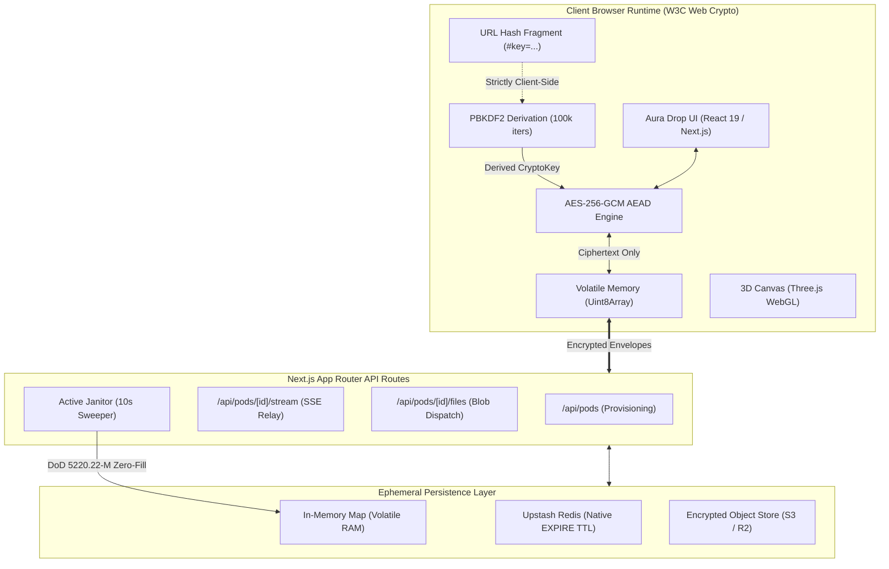
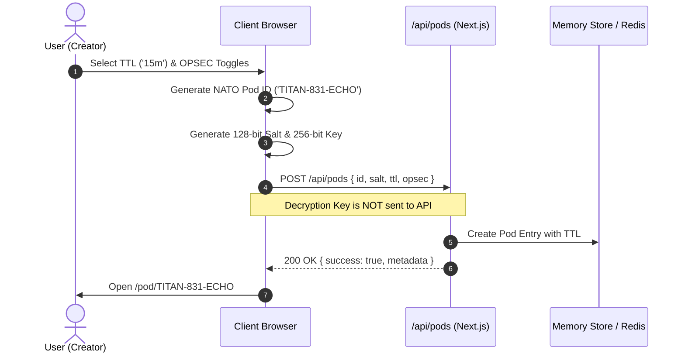
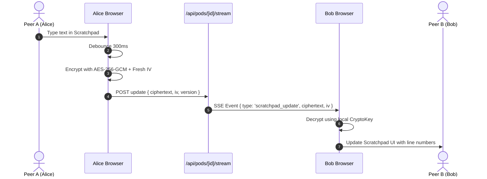
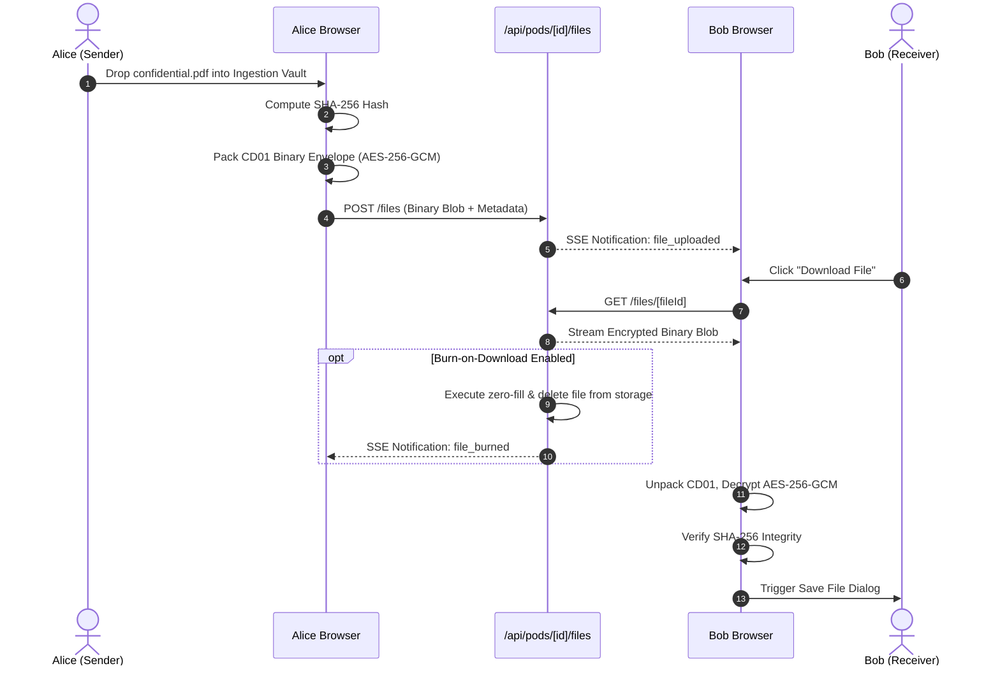

# AURA DROP — System Architecture & Security Specification

**Document Version:** 2.0.0  
**Status:** Approved / Active Architecture  
**Architect:** Principal Software Architect & Staff Security Engineer  
**Classification:** Cryptographic Zero-Knowledge System Architecture  

---

## 1. High-Level Architecture Overview

AURA DROP is architected as an **Edge-Centric Zero-Knowledge Ephemeral Application**. The system cleanly decouples identity, persistence, and cryptographic execution. The server acts exclusively as an untrusted, blind message and blob relay, while the client maintains sole custody of cryptographic keys and plaintext data.



---

## 2. Technology Stack & Component Architecture

### 2.1 Core Technologies
- **Application Framework:** Next.js 16 (App Router with Turbopack).
- **Runtime Environment:** Node.js 20+ / Edge Runtime.
- **Frontend Engine:** React 19 (Server Components + Interactive Client Pods).
- **Styling & Design System:** Vanilla CSS + Tailwind CSS v4 with custom glassmorphism design tokens.
- **Motion & Dynamics:** `framer-motion` (physics-based springs: `stiffness: 300, damping: 30`).
- **3D WebGL Engine:** Three.js, `@react-three/fiber`, `@react-three/drei`.
- **Audio Synthesizer:** Native Web Audio API procedural oscillator synthesis.
- **Client Cryptography:** W3C Web Crypto API (`window.crypto.subtle`).
- **Data Persistence:** In-Memory Map with optional `@upstash/redis` (Edge-compatible REST).

### 2.2 System Component Topology

```
src/
├── app/
│   ├── api/
│   │   └── pods/
│   │       ├── route.ts                 # Pod provisioning (POST /api/pods)
│   │       └── [id]/
│   │           ├── route.ts             # State query & zeroize trigger
│   │           ├── events/route.ts      # Tactical message broadcast
│   │           ├── stream/route.ts      # Server-Sent Events (SSE) live sync
│   │           └── files/
│   │               ├── route.ts         # Encrypted file upload & listing
│   │               └── [fileId]/route.ts# File download & instant burn
│   ├── globals.css                      # Aura Drop light-theme design tokens
│   ├── layout.tsx                       # Root layout & font definitions
│   ├── page.tsx                         # Landing Hub entry point
│   └── pod/[id]/page.tsx                # Ephemeral Workspace Room
├── components/
│   ├── canvas/
│   │   └── AuraCanvas.tsx               # Three.js 3D refractive glass & particle canvas
│   ├── landing/
│   │   └── LandingHub.tsx               # Provisioning hub & OPSEC configuration
│   ├── layout/
│   │   └── Navbar.tsx                   # Floating pill header & system status
│   └── workspace/
│       ├── DeadDropVault.tsx            # "The Ingestion Vault" (Drag-and-Drop)
│       ├── Scratchpad.tsx               # Luminous Collaborative Scratchpad
│       ├── TacticalSignalStream.tsx     # Zero-knowledge transient chat & audit log
│       ├── WorkspaceHUD.tsx             # Radial timer, peer rings, & kill-switch
│       └── ZeroizeOverlay.tsx           # Full-screen decontamination sequence
├── lib/
│   ├── crypto.ts                        # Web Crypto API engine & envelope packer
│   ├── sound.ts                         # Web Audio procedural sound effects
│   └── storage.ts                       # Ephemeral store, SSE event bus, & janitor
└── types/
    └── vault.ts                         # Strict TypeScript domain interfaces
```

---

## 3. Cryptographic Specification & Zero-Knowledge Model

### 3.1 Threat Matrix & Defensive Guarantees

| Attack Vector | Threat Scenario | Architectural Defense |
| :--- | :--- | :--- |
| **Server Seizure / Host Compromise** | Attacker dumps server RAM, disk, and database. | Server holds only salts and encrypted payloads. Keys are never transmitted; data cannot be decrypted. |
| **Network Interception (MITM)** | TLS termination proxy or ISP intercepts traffic. | Plaintext never leaves browser; payloads are pre-encrypted with AES-256-GCM. URL fragment is omitted by HTTP spec. |
| **Memory Extraction Post-Session** | Forensic analysis of browser memory after tab closure. | `wipeMemory()` actively zeroes out `Uint8Array` buffers before unmounting. |
| **Tampering / Bit-Flipping** | Attacker modifies ciphertext in transit or storage. | AES-256-GCM authenticated tag (128-bit) fails decryption instantly; SHA-256 verifies payload integrity. |
| **Link Leakage via Referrer** | Browser sends URL with secret to third parties. | Referrer Policy is strictly configured to `no-referrer`. URL fragment `#key=...` is never sent in Referrer header. |

### 3.2 URL Hash Fragment Isolation (`#key=...`)
Per **RFC 3986 Section 3.5**, the fragment identifier (`#`) is evaluated strictly by the client-side user agent and is **never** sent in HTTP request headers:
```
https://auradrop.io/pod/CYPHER-749-ALPHA#key=TITAN-BRAVO-ECHO-99-A7F2
│                                     │ │                              │
└──────────── Transmitted ────────────┘ └─────── Client Only ──────────┘
```
Even if an intermediate proxy logs every HTTP query parameter, the decryption key remains strictly isolated inside the browser runtime.

### 3.3 Key Derivation Pipeline (PBKDF2)
```
Passphrase / Key (from #key=...)
       │
       ▼
TextEncoder.encode() -> UTF-8 Bytes
       │
       ▼
Import Raw Key ("PBKDF2")
       │
       ▼
PBKDF2 Derivation:
├── Salt: 128-bit cryptographically secure random bytes
├── Iterations: 100,000 rounds
└── Hash Function: SHA-256
       │
       ▼
Derived AES-256-GCM CryptoKey (Usages: ["encrypt", "decrypt"])
```

### 3.4 Binary Envelope Packing (`CD01` Format)
All files and scratchpad payloads are packaged into a structured binary format:
```
+---------------+---------------+---------------------------------------+---------------+
| Magic (4B)    | IV (12B)      | Ciphertext (N Bytes)                  | Auth Tag (16B)|
| 0x43 0x44 0x30 0x31           | AES-256-GCM Encrypted Payload         | GCM Mac Tag   |
+---------------+---------------+---------------------------------------+---------------+
```
1. **Magic Bytes:** `CD01` (`0x43, 0x44, 0x30, 0x31`) identifies the payload version.
2. **IV (Nonce):** 96-bit unique cryptographically random vector generated via `crypto.getRandomValues`.
3. **Ciphertext & Auth Tag:** Ciphertext concatenated with 128-bit GCM authentication tag.

---

## 4. Ephemeral Storage Engine & Janitor Sweeper

### 4.1 Dual-Tier Storage Architecture
- **Tier 1 (Volatile Primary):** Node.js runtime `Map<string, PodFullState>` providing microsecond read/write access.
- **Tier 2 (Distributed Fallback):** Optional `@upstash/redis` integration for serverless edge deployment using native `EXPIRE` keys with exact TTL seconds.

### 4.2 Active Janitor Sweeper (DoD 5220.22-M Zero-Fill)
The background janitor runs on a continuous 10-second timer (`setInterval`):
```typescript
setInterval(async () => {
  const now = Date.now();
  for (const [podId, pod] of memoryStore.entries()) {
    if (pod.metadata.expiresAt <= now || pod.metadata.isZeroized) {
      await purgePod(podId, 'LIFECYCLE_TTL_EXPIRED');
    }
  }
}, 10_000);
```

When `purgePod` is invoked:
1. **DoD Zero-Fill:** Any in-memory file buffers are explicitly overwritten with zeroes (`buffer.fill(0)`).
2. **SSE Broadcast:** Emits `{ type: 'zeroize', reason }` to all active SSE subscribers (`/api/pods/[id]/stream`).
3. **Map Eviction:** Deletes pod entries from `memoryStore` and deletes Redis keys.
4. **Connection Termination:** Forcefully closes open Server-Sent Event response streams.

---

## 5. End-to-End Data Flows

### 5.1 Pod Creation & Provisioning


### 5.2 Collaborative Scratchpad Real-Time Sync


### 5.3 File Ingestion & Burn-on-Download Flow

